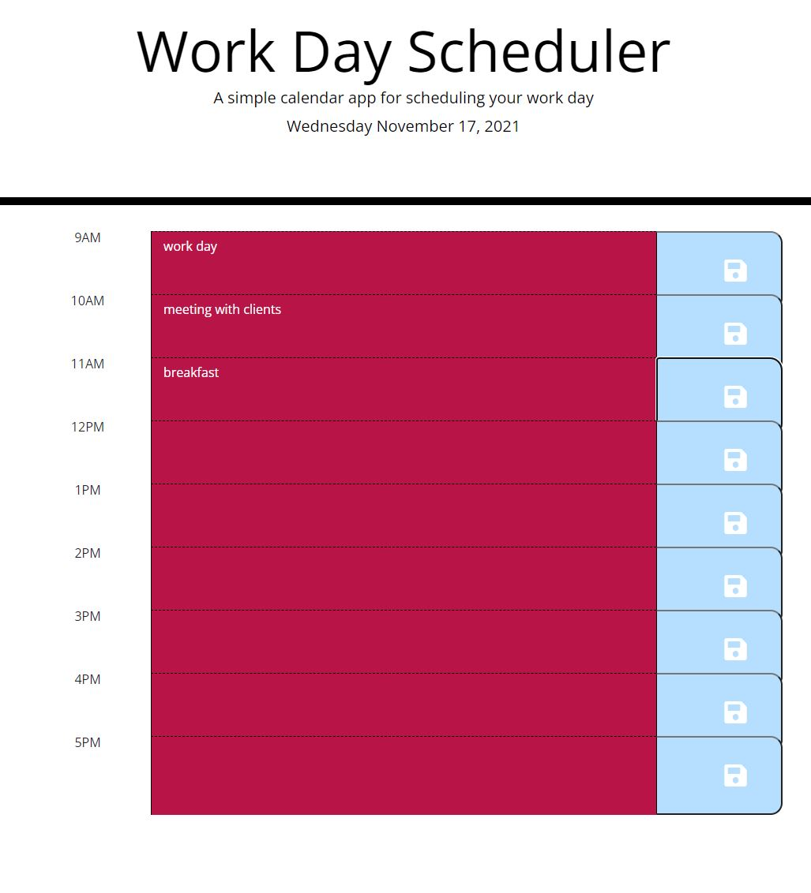

# WORK DAY SCHEDULER

## Description

this is a work scheduler web app build using HTL, CSS3 and JAVASCRIPT utilizing moment.js.

## Table Of Content

- [Overview](#overview)
- [Technologies](#technologies)
- [Installation](#installation)
- [Usage](#usage)
- [License](#license)
- [Questions](#questions)

## Overview

This application work in any browser supports javascript. clone repo and open in an IDE(preffered visual studio) open in default browser to use app.

## Technologies

- HTML
- CSS3
- JAVASCRIPT

## License

 
This repository is licensed under the MIT license.

## Questions

For any questions,please contact [lohith05amal@gmail.com](mailto:lohith05amal@gmail.com). View all my works [AmalLohith](https://github.com/LohithAmal)

[LIVE LINKS](https://lohithamal.github.io/workdayscheduler/)
